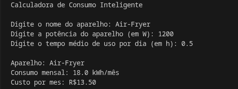

# Calculadora de Consumo Elétrico

## Objetivo
## Tecnologias Utilizadas
 Python     
## Fórmula para cálculo
Consumo Mensal(kWh) = (Potência(W) . Horas . 30) : 1000  
## Como testar
**É necessário ter o Pyhton instalado no computador para executar.**
